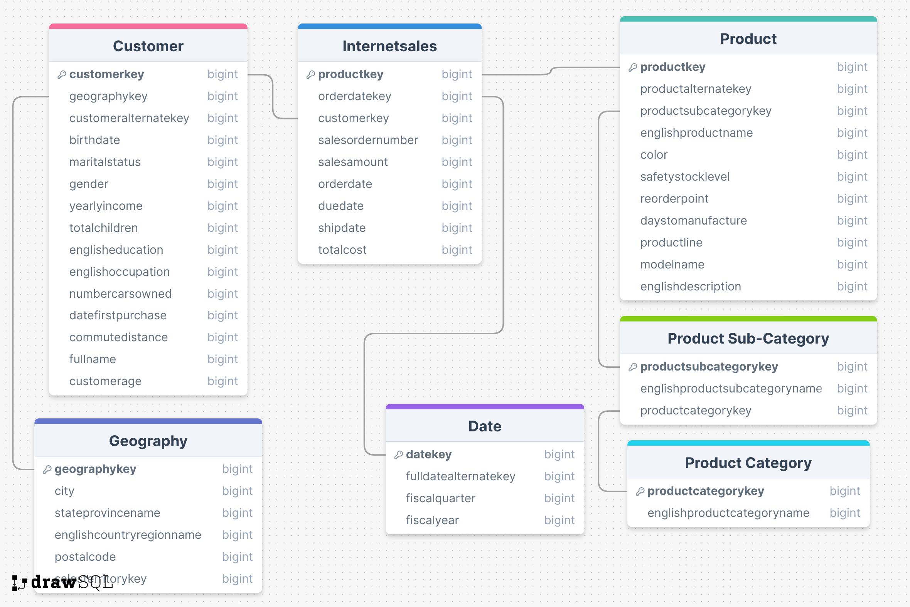

# The Bike Haven – Sales Dashboard (Tableau)

Interactive Tableau dashboard and story built for **The Bike Haven**, a fictional bike shop. The goal was to replace static sales reports with an interactive dashboard covering product, customer, and regional performance, plus a deeper analytical story.

## Live deliverables

- [Dashboard PDF](Tableau_Project_PDF.pdf)
- [Demo video (filters and interactivity)](https://youtu.be/Pt8wIBzi50Y)

## Project brief

Chris, the sales manager, wanted a move from static reports to interactive dashboards tracking sales volume by product, customer, and time, with filters so sales reps can drill into their own customers and products. Requirements are in `Course_Project_Description.pdf`.

Required visuals:
- Top 10 products by sales amount
- Top 10 customers
- Sales vs. budget
- Sales by region/city
- Product category vs. sales amount

## What's in the dashboard

**Main dashboard**
- KPI strip: Total Sales, Total Orders, Total Profit, Total Profit Margin %
- Best-Selling Products (top 10, horizontal bar)
- Sales by Category (pie: Bikes, Accessories, Clothing)
- Top Customers (top 10, horizontal bar)
- Sales Performance: Actual vs. Budgeted sales, dual-axis, 2021–2023
- Regional Sales (map, filled by country/state)
- Filters: Product Line, Select Year

**Story (7 additional pages)**
1. Sales distribution by gender and age group (heatmap)
2. Customer age distribution (histogram)
3. Annual profit margin % (heatmap, 2021–2023)
4. Fiscal-year profit margin % by quarter (bar chart)
5. Sales by occupation and marital status (bar chart)
6. Average yearly income by country (map)
7. Relation between customer income and sales (scatter), most profitable product line (pie), daily new customers over time, total sales/orders over time, top 10 cities by sales

## Key findings

- Road Bikes and Mountain Bikes drive ~85% of profit (46.4% and 38.9% respectively); Standard/Street Bikes are the smallest contributor at 2.5%.
- Bikes make up 96.5% of sales value; Accessories and Clothing are a small share despite higher unit counts.
- Profit margin held steady around 41% through 2021–2022, then jumped to 57.2% in 2023 (Q3 2022 already showed an early spike to 55.9%).
- Sales and new-customer acquisition both increased sharply starting early 2022.
- London is the top city by sales (803K), well ahead of Paris (540K).
- Australia has the highest average customer income (64,339) despite not leading in sales; France has the lowest (35,762).

## Data model

Star schema with `Internetsales` as the fact table:

- **Internetsales** (fact) → `productkey`, `orderdatekey`, `customerkey`, `salesordernumber`, `salesamount`, `orderdate`, `duedate`, `shipdate`, `totalcost`
- **Customer** → joins to Internetsales on `customerkey`, to Geography on `geographykey`
- **Geography** → `geographykey`, city, state/province, country, postal code
- **Product** → joins to Internetsales on `productkey`, to Product Sub-Category on `productsubcategorykey`
- **Product Sub-Category** → joins to Product Category on `productcategorykey`
- **Product Category**
- **Date** → joins to Internetsales on `datekey` = `orderdatekey`

## Data source and preparation

Source data came from a PostgreSQL-restored AdventureWorks-style bike shop database (7 tables: customer, sales, date, product, category, subcategory, geography) plus a 2023 budget spreadsheet supplied by the client.

Preparation done in SQL (in pgAdmin) before export:
- Joined Product, Product Sub-Category, and Product Category into one flat product table
- Joined Customer and Geography into one flat customer table
- Dropped unused columns
- Exported each resulting table to CSV for Tableau

Files in this repo:

| File | Rows | Description |
|---|---|---|
| `Internet_Sales.csv` | 60,398 | Fact table: one row per order line (product, customer, dates, sales amount, cost) |
| `Products_Combined.csv` | 606 | Product + subcategory + category, flattened |
| `Customer___Geography_Combined.csv` | 18,484 | Customer + geography, flattened |
| `Date.csv` | 6,939 | Calendar dimension (date, fiscal quarter, fiscal year) |
| `SalesBudget.csv` | 30 | Monthly budget figures for 2021–2023, used for the sales-vs-budget chart |

Note: two years of actual sales (2021–2022) are compared against budget in the dashboard, per the client's request to review performance against the previous two years.

## Tools used

- PostgreSQL / pgAdmin – data restore and SQL joins
- Tableau Desktop – dashboard and story build
- Export format – PDF, A4 portrait
